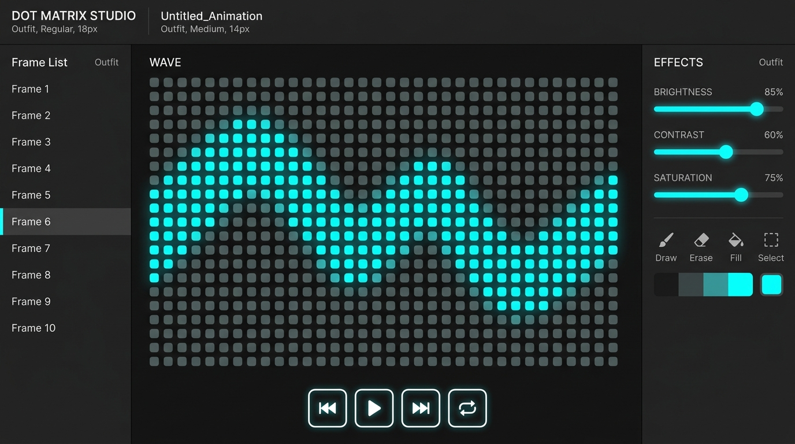
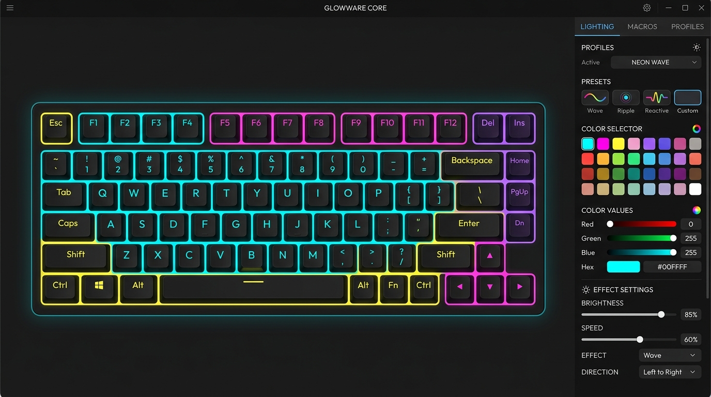

# Epomaker DynaTab 75X Controller & Screen Designer

[](https://opensource.org/licenses/MIT)
[](https://www.python.org/downloads/)
[](https://www.kernel.org/)
[](https://gitter.im/)

A complete, feature-rich Linux controller utility and interactive pixel art animation suite for the **Epomaker DynaTab 75X** mechanical keyboard. 

This utility allows you to control key backlighting, customize the onboard 60x9 dot-matrix display with advanced image adjustments, sync system time, and build custom animations without needing the official Windows driver.

---

## Key Features

### 🎨 1. Interactive LED Screen Designer (GUI)


A full-featured pixel editor designed specifically for the DynaTab 75X's 60x9 dot-matrix screen:
* **Interactive Grid:** Draw directly on the canvas with left-click, erase with right-click, or use the Eyedropper tool to pick colors.
* **Animation Controller:** A multi-frame builder letting you copy, add, delete, and re-order frames (limited to a hardware-safe maximum of 15 frames to prevent flash memory allocation overflows).
* **GIF Import/Export:** Import any animated `.gif` or static image (featuring a custom interactive crop/zoom dialog for larger files). Export custom designs as highly shareable, scaled-up `.gif` files.
* **Real-time Image Adjustments:** Dedicated sliders to customize **Brightness**, **Contrast**, and **Saturation** across all frames.
  * *Non-destructive Editing:* Stores base drawings and adjustments separately, meaning you can adjust values back and forth indefinitely without losing pixel detail.
  * *Custom Painting Integration:* Any pixel you manually paint on top of an adjusted image is saved in its pure state and dynamically corrected.
* **Shift Pad Controls:** Shift the active frame in 4 directions (`Up/Down/Left/Right` with wrap-around) to create smooth scroll animations.

### ⌨️ 2. Visual Key Backlight Customizer (GUI)


A dark mechanical-switch themed keyboard layout customizer to paint individual keys:
* **Color Picker & Swatches:** Built-in RGB sliders and a 12-preset color swatch palette directly on-screen—no annoying popup dialogs.
* **Multi-Mode Painting:**
  * *Paint Brush Mode:* Click any key to immediately paint it with your active color.
  * *Selection Mode:* Click multiple keys to select them (sunken red highlight), then color them all at once by clicking a swatch or dragging a slider.
* **Bulk Select All:** Select and color all keys on the keyboard simultaneously.
* **Layout Management:** Save custom color layouts to JSON files and reload them at any time.
* **Preset Backlight Profiles:** Choose effect modes (Waves, Breathing, Twinkle, Always On, etc.), adjust brightness/speed, and apply presets directly. Setting a preset automatically pauses custom layouts so the animation can run, and painting any key instantly resumes custom mode.

### 🕒 3. System Time Sync
Instantly synchronize the keyboard's integrated digital clock with your local system time.

---

## Installation & Setup

### 1. Prerequisites
Ensure you have Python 3.8+ and the required development libraries installed. On Ubuntu/Debian:
```bash
sudo apt update
sudo apt install -y python3-pip python3-venv libusb-1.0-0-dev libudev-dev
```

### 2. Configure USB Permissions (Udev Rules)
By default, Linux restricts raw HID interface writes. Run the included setup script to grant your user account access to the keyboard interfaces:
```bash
chmod +x setup_udev.sh
sudo ./setup_udev.sh
```
*Note: Unplug and replug the keyboard's USB cable for the new rules to take effect!*

### 3. Install the Controller
Create a virtual environment and install the package in editable mode:
```bash
# Clone the repository
git clone https://github.com/YOUR_GITHUB_USERNAME/epomaker-controller.git
cd epomaker-controller

# Setup virtual environment
python3 -m venv .venv
source .venv/bin/activate

# Install package and dependencies
pip install -e .
```

---

## How to Use

Ensure your virtual environment is active:
```bash
source .venv/bin/activate
```

### 1. Launch the Main GUI
You can open either customizer directly from your terminal and navigate between them using the built-in **"Switch"** buttons:
```bash
# Open Key Backlight Painter
epomakercontroller set-keys

# Open LED Screen Designer & Animator
epomakercontroller screen-designer
```

### 2. Sync Time (CLI)
```bash
epomakercontroller send-time
```

### 3. Save a Solid Backlight Profile (CLI)
Saves a solid color configuration to the keyboard's onboard hardware profile. For example, to set the board to solid Teal:
```bash
epomakercontroller set-profile 0 128 128
```

### 4. Upload Image or GIF Directly (CLI)
Upload any image/GIF from the command line (automatically resizes and centers):
```bash
# Upload a static image
epomakercontroller upload-image path/to/image.png

# Upload a GIF with a custom 150ms frame delay
epomakercontroller upload-image path/to/animation.gif --delay 150
```

---

## Protocol & Hardware Pacing Specifics

The Epomaker controller interacts with the keyboard across three main USB HID interfaces:
* **Interface 0 (Input):** Handles normal key presses and configuration apply/activation triggers.
* **Interface 1 (System Control):** Lighting, profile controls, and custom key backlight color transfers.
* **Interface 2 (Media/Screen):** Dot-matrix screen graphics and animation buffers.

To guarantee successful communication and prevent hardware crashes, this controller implements several protocol-specific solutions:
1. **Mutex Lock Interface Teardown:** Linux locks the device if multiple HID interfaces are accessed simultaneously. When writing to the screen (Interface 2), the controller temporarily disconnects from Interface 1, performs the write, and then safely re-opens Interface 1.
2. **Erase Delay (250ms):** Sending the initialization report (`0xa9` for screen, `0x18` for keys) triggers a flash write/erase cycle. The controller inserts a `250ms` delay after this command to prevent subsequent packets from being dropped.
3. **Report Packet Pacing (10ms):** The keyboard's SRAM endpoint buffer overflows if USB reports are written too quickly. Pacing data reports (`0x29` for screen, `0x19` for keys) at least `10ms` apart prevents dropped packets and layout jumbling.
4. **Keymap Correction:** The right-side keys on standard DynaTab 75X boards map to Royuan firmware index values (e.g. Enter to 80, Right Arrow to 83, Del to 78, PgUp to 84, PgDn to 90). The key maps have been corrected to ensure they light up correctly.

---

## Contributing
Pull requests are welcome! If you find any protocol offsets or want to add support for another Epomaker model, feel free to open an issue or submit a PR.

## License
MIT License. Feel free to copy, modify, and distribute!
