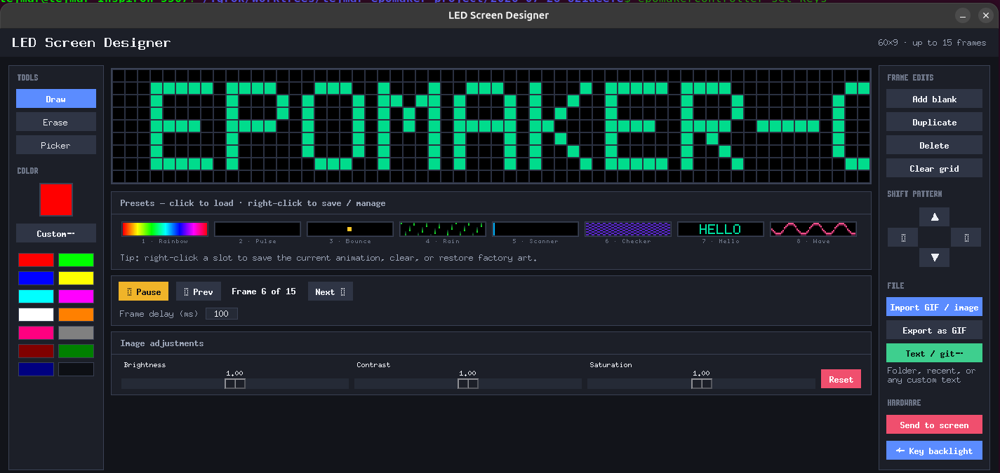
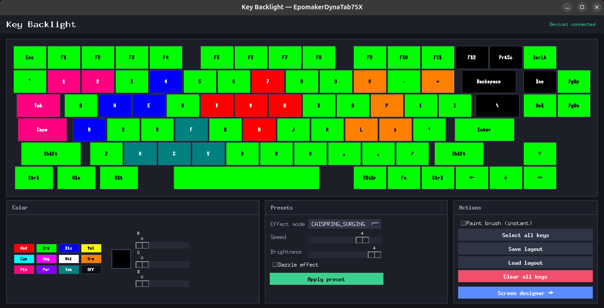

# Epomaker Controller

[](https://opensource.org/licenses/MIT)
[](https://www.python.org/downloads/)
[](https://www.kernel.org/)
[](https://github.com/tejmar/epomaker-controller/actions/workflows/ci.yml)
[](CONTRIBUTING.md)

> **No Windows driver required.** A Linux-native Python controller for Epomaker / Royuan keyboards — per-key RGB, DynaTab 60×9 screen designer, clock sync, CPU/temp daemon, and more.


**Supported models** (switch with `epomakercontroller models set …`):

| Model id | Keyboard | Highlights |
|---|---|---|
| `dynatab75x` | Epomaker DynaTab 75X | Per-key RGB + 60×9 screen designer |
| `rt100` | Epomaker RT100 (UK ISO) | Per-key RGB + RT100 status-screen images |
| `ep64` | Epomaker EP64 | Per-key RGB |
| `gamakay-tk68-he` | Gamakay TK68-HE | Per-key RGB |

---

## Table of Contents

- [Features](#key-features)
- [Screenshots](#screenshots)
- [Installation](#installation--setup)
- [Select your keyboard](#select-your-keyboard)
- [Usage](#how-to-use)
- [Protocol Details](#protocol--hardware-pacing-specifics)
- [Development](#development)
- [Contributing](#contributing)
- [License](#license)

---

## Key Features

| Feature | Description |
|---|---|
| 🎨 Screen Designer | Frame-by-frame pixel editor for the DynaTab 60×9 display |
| ⌨️ Key Backlight Customizer | Paint per-key RGB colors in real time |
| 🖼️ GIF/Image Import | Import animated GIFs or images with an interactive crop tool |
| 🎚️ Image Adjustments | Brightness, contrast, and saturation (non-destructive) |
| ⭐ Screen presets | Eight local thumbnail slots (factory art + your saves) |
| 🔤 Text / git on screen | Free text, pick folder, or recent paths → 60×9 bitmap |
| 💾 Layout Profiles | Save and reload custom color layouts as JSON |
| 🎭 Preset Effects | Built-in backlight modes (Wave, Breathe, Twinkle, etc.) |
| 🕒 Time Sync | Sync the keyboard clock to system time |
| 🔄 Model Profiles | Switch layouts/keymaps/capabilities from the CLI |
| 🐧 Linux Native | No Windows VM, no Wine — pure Python over USB HID |

---

## Screenshots

### LED Screen Designer


### Key Backlight Customizer


---

## Key Feature Details

### LED Screen Designer (GUI)
Pixel editor for the DynaTab 75X 60×9 dot-matrix screen:

* **Interactive grid** — left-click draw, right-click erase, eyedropper to pick colors
* **Animation** — add, duplicate, delete, and navigate frames; Play/Pause preview; max **15** frames (hardware limit)
* **Preset slots** — eight thumbnail favorites under the canvas; click to load, right-click to save/clear/restore factory
* **Text / git…** — type anything, pick a project folder (git root name), or reuse a recent entry
* **GIF import/export** — import `.gif` or static images with crop/zoom; export a scaled shareable GIF
* **Adjustments** — brightness, contrast, saturation across all frames (base pixels kept separately)
* **Shift pad** — nudge the active frame with wrap-around for scroll animations

### Key Backlight Customizer (GUI)

* RGB sliders and preset swatches on-screen
* Paint-brush mode for instant key coloring
* Multi-select keys (accent ring), then apply a color
* Save/load layout JSON
* Built-in profile effects (speed, brightness, dazzle)

### Seamless GUI switching
Use **Switch** between Screen Designer and Key Backlight Customizer; painted layouts, frames, and slider settings stay in memory.

---

## Installation & Setup

**Requirements:** Linux, Python **3.10+**, a supported keyboard over USB (wired or 2.4 GHz dongle per config).

### 1. System packages
```bash
sudo apt update
sudo apt install -y python3-pip python3-venv libusb-1.0-0-dev libudev-dev python3-tk
```

### 2. USB permissions
Linux blocks raw HID writes by default. Run once, then **unplug and replug** the keyboard:

```bash
chmod +x setup_udev.sh
sudo ./setup_udev.sh
```

### 3. Clone and install
```bash
git clone https://github.com/tejmar/epomaker-controller.git
cd epomaker-controller

python3 -m venv .venv
source .venv/bin/activate

pip install -e .
```

Config is created automatically at `~/.epomaker-controller/config.json` on first run.

---

## Select your keyboard

```bash
epomakercontroller models list          # * = current layout/keymap match
epomakercontroller models show          # layout, keymap, capabilities
epomakercontroller models set dynatab75x
```

This updates layout, keymap, and `CAPABILITIES` in the main config. Restart any open GUIs after switching.

---

## How to Use

Activate the venv first: `source .venv/bin/activate`.

### GUIs
```bash
epomakercontroller set-keys            # key backlight customizer
epomakercontroller screen-designer     # 60×9 screen designer (DynaTab)
```

### Common CLI commands
```bash
# Sync clock
epomakercontroller send-time

# Solid profile color (R G B)
epomakercontroller set-profile 0 128 128

# Temporary per-key solid color for all keys
epomakercontroller set-rgb-all-keys 255 0 0

# Upload image/GIF to the screen (model-dependent)
epomakercontroller upload-image path/to/image.png
epomakercontroller upload-image path/to/animation.gif --delay 150

# Inspect keymap (no device required)
epomakercontroller show-keymap --filter enter

# CPU / temperature on the screen (daemon)
epomakercontroller list-temp-devices
epomakercontroller start-daemon              # CPU only
epomakercontroller start-daemon coretemp-0   # CPU + named temp sensor

# Device debug
epomakercontroller dev --print
epomakercontroller dev --udev
```

### Library-style usage (optional)
```python
from epomakercontroller.configs.configs import load_main_config
from epomakercontroller.epomakercontroller import EpomakerController

with EpomakerController(load_main_config()) as ctl:
    ctl.open_device()
    ctl.send_time()
# HID device closed automatically
```

---

## Protocol & Hardware Pacing Specifics

Three USB HID interfaces (Royuan firmware):

| Interface | Purpose |
|---|---|
| 0 | Key input / apply-activate commands |
| 1 | Lighting profiles and per-key RGB data |
| 2 | Dot-matrix screen graphics and animation buffers |

Stability rules (do not remove without testing on hardware):

1. **Interface teardown** — Linux does not allow concurrent multi-interface writers; iface 1 is closed during iface 2 screen uploads.
2. **Erase delay (250 ms)** — init reports `0xa9` (screen) / `0x18` (keys) erase SRAM; a delay is required before data packets.
3. **Packet pacing (10 ms)** — endpoint buffer overflows if reports arrive too fast (historically broke right-side key colors: `O`, `L`, `,`, …).
4. **Keymap index corrections** — DynaTab right cluster uses firmware-specific indices (e.g. Enter=80, Del=78) in the keymap JSON.
5. **Thread-safe HID lock** — an `RLock` serializes writes from GUI background threads and CLI sends.

---

## Development

```bash
git clone https://github.com/tejmar/epomaker-controller.git
cd epomaker-controller
python3 -m venv .venv
source .venv/bin/activate
pip install -e ".[dev]"
pytest
```

Unit tests do **not** need a keyboard (`dry_run` + pure command builders). CI runs pytest on Python 3.10–3.12.

---

## Contributing

Pull requests and issues are welcome. See [CONTRIBUTING.md](CONTRIBUTING.md) for:

- Bug reports and feature requests
- Switching models and adding a new keyboard profile
- Protocol capture notes for new hardware

---

## License

[MIT License](LICENSE) — free to use, modify, and distribute.
