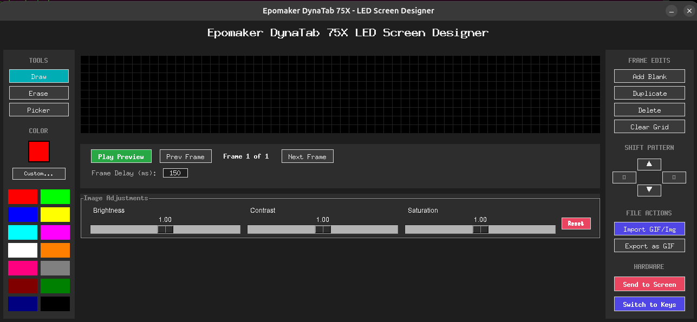
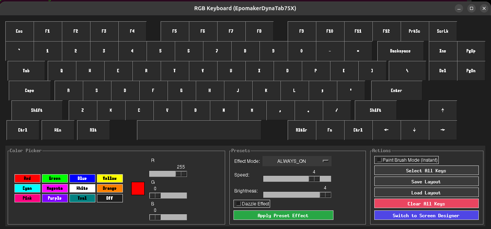

# Epomaker DynaTab 75X Controller & Screen Designer

[](https://opensource.org/licenses/MIT)
[](https://www.python.org/downloads/)
[](https://www.kernel.org/)
[](CONTRIBUTING.md)

> **No Windows driver required.** A complete Linux controller for the Epomaker DynaTab 75X — paint individual key colors, design and upload custom dot-matrix animations, sync your system clock, and more.


---

## Table of Contents

- [Features](#key-features)
- [Screenshots](#screenshots)
- [Installation](#installation--setup)
- [Usage](#how-to-use)
- [Protocol Details](#protocol--hardware-pacing-specifics)
- [Contributing](#contributing)
- [License](#license)

---

## Key Features

| Feature | Description |
|---|---|
| 🎨 Screen Designer | Frame-by-frame pixel editor for the 60x9 dot-matrix display |
| ⌨️ Key Backlight Customizer | Paint per-key RGB colors in real time |
| 🖼️ GIF/Image Import | Import animated GIFs or images with an interactive crop tool |
| 🎚️ Image Adjustments | Brightness, Contrast, and Saturation sliders (non-destructive) |
| 💾 Layout Profiles | Save and reload custom color layouts to JSON files |
| 🎭 Preset Effects | Apply built-in backlight modes (Wave, Breathe, Twinkle, etc.) |
| 🕒 Time Sync | Sync the keyboard's clock to your system time |
| 🐧 Linux Native | No Windows VM, no Wine — pure Python over HID |

---

## Screenshots

### 🎨 LED Screen Designer


### ⌨️ Key Backlight Customizer


---

## Key Feature Details

### 🎨 LED Screen Designer (GUI)
A full-featured pixel editor for the DynaTab 75X's 60x9 dot-matrix screen:
* **Interactive Grid:** Left-click to draw, right-click to erase, Eyedropper tool to pick colors.
* **Animation Controller:** Add, duplicate, delete, and navigate frames. Preview with Play/Pause. Hardware-safe maximum of 15 frames.
* **GIF Import/Export:** Import animated `.gif` or any static image. An interactive crop/zoom dialog handles large files. Export your work as a shareable scaled-up `.gif`.
* **Real-time Image Adjustments:** **Brightness**, **Contrast**, and **Saturation** sliders across all frames simultaneously.
  * *Non-destructive:* Unadjusted pixel data is preserved separately. Adjust sliders back and forth without losing detail.
* **Shift Pad:** Nudge the active frame `Up/Down/Left/Right` with wrap-around for scroll animations.

### ⌨️ Key Backlight Customizer (GUI)
* **Color Picker & Swatches:** RGB sliders and 12 preset swatches directly on-screen — no popups.
* **Paint Brush Mode:** Click any key to instantly color it.
* **Selection Mode:** Select multiple keys (highlighted in red), then batch-color them with a single swatch click.
* **Select All:** Color every key at once.
* **Layout Profiles:** Save to JSON and reload at any time.
* **Preset Effects:** Wave, Breathing, Twinkle, Always On, and more — with speed and brightness controls.

### 🔁 Seamless Screen Switching
Switch between the Screen Designer and Key Backlight Customizer using the built-in **Switch** buttons. All your painted layouts, animations, and slider settings are preserved in memory across switches.

---

## Installation & Setup

### 1. Prerequisites
```bash
sudo apt update
sudo apt install -y python3-pip python3-venv libusb-1.0-0-dev libudev-dev
```

### 2. Configure USB Permissions
Linux restricts raw HID device writes by default. Run the included setup script once:
```bash
chmod +x setup_udev.sh
sudo ./setup_udev.sh
```
> **Note:** Unplug and replug the keyboard after running this for the rules to take effect.

### 3. Clone & Install
```bash
git clone https://github.com/YOUR_GITHUB_USERNAME/epomaker-controller.git
cd epomaker-controller

python3 -m venv .venv
source .venv/bin/activate

pip install -e .
```

---

## How to Use

Make sure your virtual environment is active (`source .venv/bin/activate`), then:

### Open the Key Backlight Customizer (GUI)
```bash
epomakercontroller set-keys
```

### Open the LED Screen Designer & Animator (GUI)
```bash
epomakercontroller screen-designer
```

### Sync System Time to Keyboard
```bash
epomakercontroller send-time
```

### Set a Solid Backlight Color (CLI)
```bash
# R G B  — e.g. teal:
epomakercontroller set-profile 0 128 128
```

### Upload an Image or GIF Directly (CLI)
```bash
epomakercontroller upload-image path/to/image.png

# With custom frame delay for animations:
epomakercontroller upload-image path/to/animation.gif --delay 150
```

---

## Protocol & Hardware Pacing Specifics

The keyboard communicates over three USB HID interfaces:

| Interface | Purpose |
|---|---|
| Interface 0 | Key input, configuration activation/apply commands |
| Interface 1 | Lighting profiles, custom key backlight color data |
| Interface 2 | Dot-matrix screen graphics and animation buffers |

Several protocol-specific solutions are implemented to guarantee stability:

1. **Mutex Interface Teardown:** Linux locks the device when multiple HID interfaces write simultaneously. Interface 1 is safely closed during Interface 2 screen writes, then reopened.
2. **Erase Delay (250ms):** The init reports (`0xa9` screen, `0x18` keys) trigger an SRAM erase cycle. A 250ms delay prevents subsequent packets from being dropped during erase.
3. **Report Packet Pacing (10ms):** The keyboard's SRAM endpoint buffer overflows when reports arrive too fast. 10ms pacing prevents dropped packets — which was causing right-side keys (`O`, `L`, `,` and beyond) to not change color.
4. **Keymap Index Corrections:** Right-side DynaTab 75X keys use Royuan firmware-specific index values — corrected to: Enter=80, Del=78, Right=83, PgUp=84, PgDn=90, PrtSc=86, ScrLk=88.
5. **Thread-Safe Locking:** A `threading.Lock` serializes all concurrent HID writes from the GUI background thread and preset thread, preventing device crashes.

---

## Contributing

Pull requests and issues are welcome! See [CONTRIBUTING.md](CONTRIBUTING.md) for how to:
- Report bugs
- Request new keyboard model support
- Add a new keyboard model yourself

---

## License
[MIT License](LICENSE) — feel free to copy, modify, and distribute.
